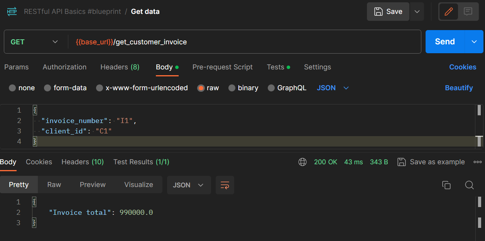

# InvoiceManagment
This repository contains the implementation of a invoice management in Django

## Installation	

### Clone the repository
```bash
git clone https://github.com/CristianPerafan/InvoiceManagment.git
cd InvoiceManagment
```

### Create a virtual environment
```bash
python -m venv venv
./venv/bin/activate
```

### Install dependencies
```bash 
pip install -r requirements.txt
```

### Run the server
```bash
python manage.py runserver
```
### Make migrations and migrate
```bash
python manage.py makemigrations
python manage.py migrate
```
### Create a superuser
```bash
python manage.py createsuperuser
```
### Run th server
```bash
python manage.py runserver
```

### Open admin page
```bash
http://127.0.0.1:8000/
```

## Add information to the database

The django admin view can be used to add information to the database. because I did not have enough time to implement a script to add information to the database.


## Example of use
The http://127.0.0.1:8000/get_customer_invoice/ endpoint can be used to get the invoice information of a customer. The endpoint receives the customer id as a parameter and invoice number. The following image shows an example of use.



The customer have 1 invoice with 6 items, the total amount is $110000$ and the total amount and with the discount the final amount is $990000.0$.


